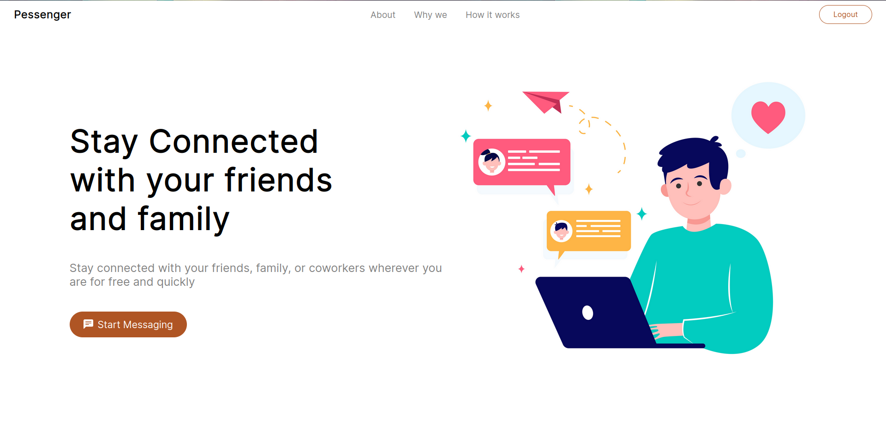
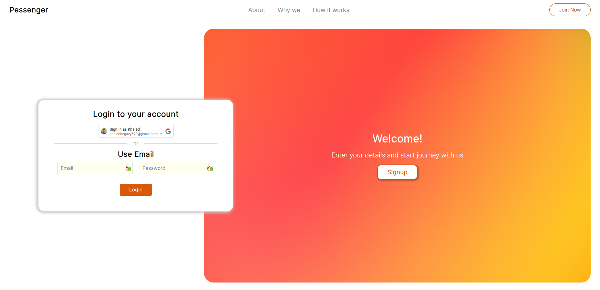
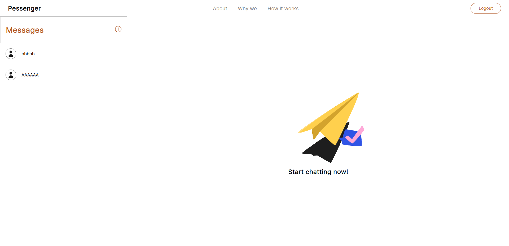

# Pessenger (Peach Messenger)

Pessenger is a chat application that clones some features from Messenger. It provides real-time messaging functionality and incorporates various technologies for frontend UI management, backend server, user authentication, and deployment.

## Technologies Used

- **Frontend**: React.js
- **Backend/API**: Node.js
- **User Authentication**: JWT (JSON Web Tokens)
- **Real-time Chat**: Socket.io
- **Deployment**: Docker (Containerization) on AWS EC2 Instance
- **Website Serving**: Nginx (HTTPS and Reverse Proxy)

## Features

- Real-time messaging: Pessenger allows users to engage in real-time conversations, ensuring prompt communication.
- User authentication: JWT is implemented to secure user authentication and protect user data.
- Easy deployment: The app can be containerized using Docker and deployed to an AWS EC2 instance.
- Secure website serving: The website is served over HTTPS and utilizes Nginx as a reverse proxy server for enhanced security.

## Screenshots

Here are a few screenshots showcasing the Pessenger application:

## Try It Out

To try out Pessenger, you can access the deployed application at [pessenger.online](http://pessenger.online).

## Development

If you prefer to run the application without Docker for development purposes, follow these steps:

1. Install Docker on your machine if you haven't already.
2. Clone the repository: `git clone https://github.com/KhaledHegazy222/Pessenger.git`
3. Navigate to the project directory: `cd Pessenger`
4. Build and run the Docker containers: `docker-compose up --build`
5. Open your browser and visit `http://localhost:3000` to access the application.

Please note that running the app using Docker requires Docker and Docker Compose to be installed on your machine.
